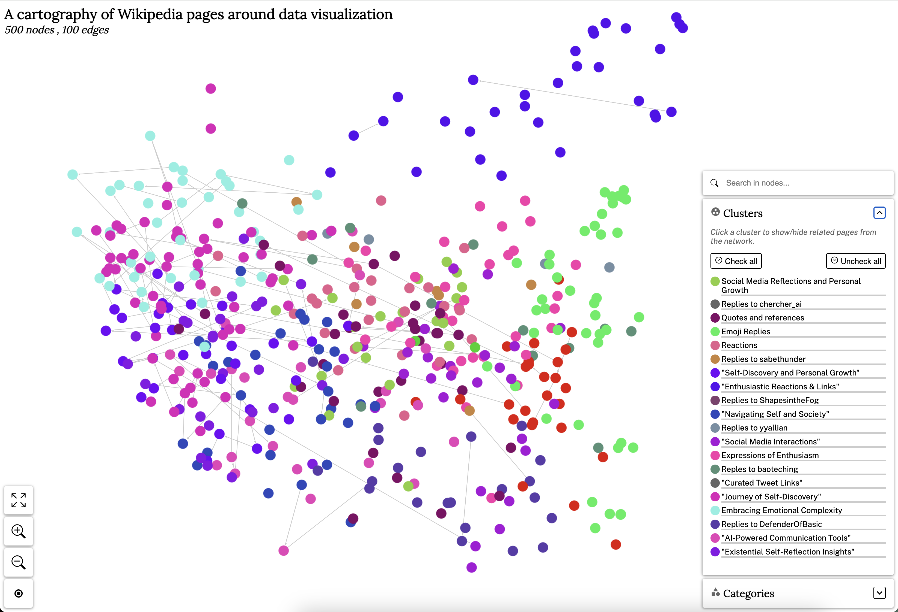

# WIP

This is an in-progress tooklit to take a twitter archive and plot it in 2D, like so:

To use it:

0. Get your twitter archive and copy `data/tweets.js` to the root of this project as `tweets.json`. Modify it to be JSON and not JS

1. Copy .env.example as .env and add an OpenAI API key.

2. npm install in root directory

3. Run `npx ts-node embed_tweets.ts` to embed the tweets.

4. Run `node elbowCluster.js` to cluster the tweets.

5. Pick one of the cluster sets and rename it to `clustered_tweets.json`

6. Run `node makeGraph.js` to generate the graph data

7. Open a terminal and cd to `packages/demo` and npm install and npm start

It should work! If it doesn't, please open an issue.